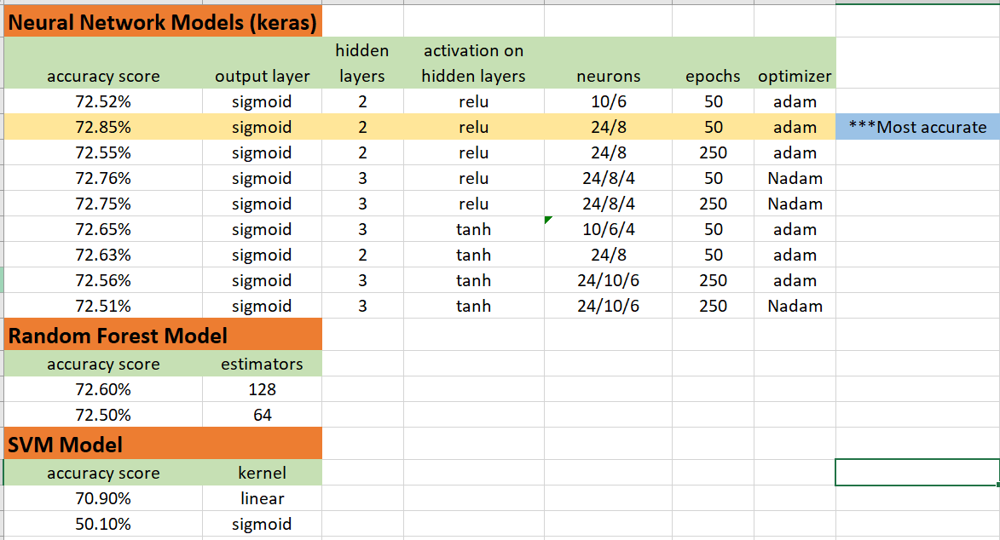

# AlphabetSoupCharity_NeuralNetworks

This analysis uses neural network models and supervised learning models to evaluate data from a charity with over 34,000 rows.  The rows represent different organizations which have applied for funding over the years.  The data has the following format.

- EIN and NAME—Identification columns
- APPLICATION_TYPE—Alphabet Soup application type
- AFFILIATION—Affiliated sector of industry
- CLASSIFICATION—Government organization classification
- USE_CASE—Use case for funding
- ORGANIZATION—Organization type
- STATUS—Active status
- INCOME_AMT—Income classification
- SPECIAL_CONSIDERATIONS—Special consideration for application
- ASK_AMT—Funding amount requested
- IS_SUCCESSFUL—Was the money used effectively

# Explanation of Processing
The csv data is read into a DataFrame and then cleaned for processing.  

- Drop the EIN and NAME identifier columns 
- Convert STATUS and ASK_AMT to str ('object') type
- Bucket the categorical variables if needed.  In this case, CLASSIFICATION, APPLICATION_TYPE and ASK_AMT
- Encode categorical variables using one-hot encoding
- Merge one-hot encoded features and drop their original columns
- Prepare for processing by splitting into training and testing datasets
- Scale the data so it can be processed
- Run several models to attempt acquiring a 75% accuracy score.

Several models were used to try to reach the 75% accuracy score.  For the neural network model, several hidden layers were attempted.  Neurons were adjusted. Number of epochs were increased.  Different optimizers were tried.  The activations attemped were 'relu' and 'tanh'.  Also, an attempt was made to drop rows of noisy data from the ASK_AMT column.  This was unsuccessful and the attempt was abandoned.

Below is a chart of the various models attempted and the parameters used. While the 75% target was not achieved, the most accurate of all the attempts was the relu with 2 layers at 24 and 8 neurons, 50 epochs and the adam optimizer. This model rendered a 72.85% accuracy score.

## Resources
- Python 3.7 in Jupyter Notebook
- Libraries: tensorflow, pandas
  - scikit-learn: train_test_aplit, OneHotEncoder, accuracy_score, StandardScaler, RandomForestClassifer, SVC
  - matplotlib density plots
- Data: charity_data.csv

